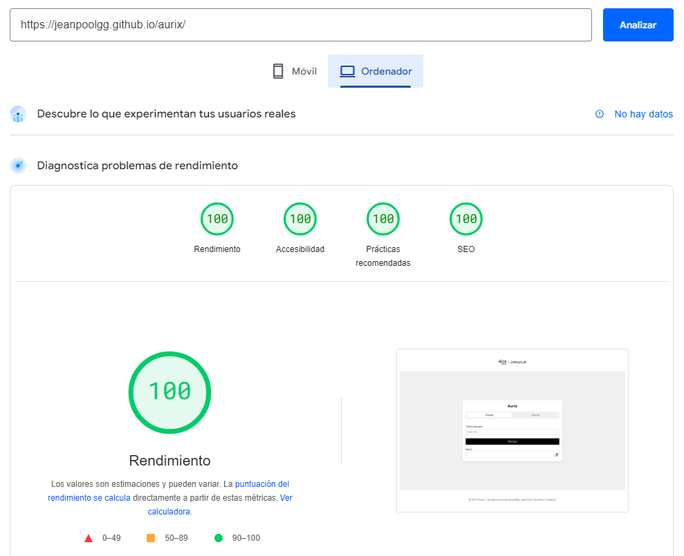
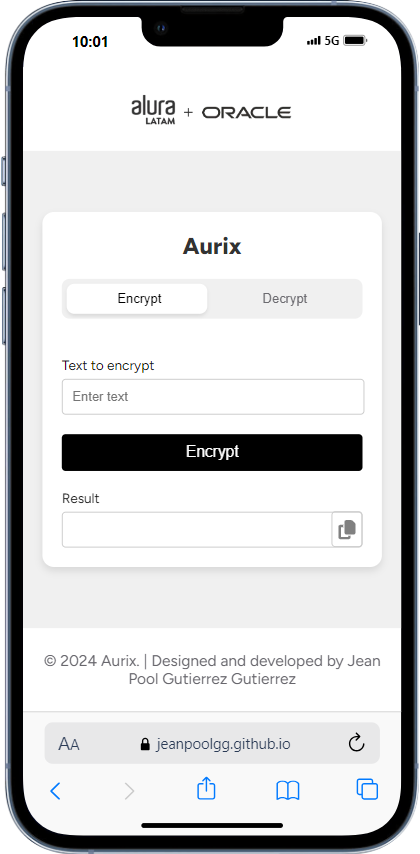

# Aurix - Solución de Encriptación y Desencriptación de Texto

**Aurix** es una solución avanzada de encriptación y desencriptación de texto, desarrollada especialmente para el **Alura Challenge - Encriptador** del programa **ONE G7**, impulsado por **Oracle y Alura**. Combina seguridad robusta con un diseño elegante y eficiente.

## Descripción

El desafío consistió en crear una aplicación web que permite encriptar y desencriptar textos, aplicando conocimientos de **HTML5**, **CSS3**, y **JavaScript**. Además, implementé funcionalidades adicionales como la validación de entradas y un botón de copia al portapapeles.

## Tecnologías Utilizadas

- **HTML5**, **CSS3**, **JavaScript**
- **BEM**: Para una estructuración clara y mantenible del CSS.
- **HTML semántico**: Para mejorar la accesibilidad y la optimización en motores de búsqueda.
- **Trello**: Para la gestión de tareas y la organización del proyecto.
- **Git** y **GitHub**: Para el control de versiones y la publicación del proyecto.
- **Figma**: Como referencia de diseño.
- **Google Lighthouse**: Para la optimización del rendimiento, accesibilidad, prácticas recomendadas y SEO.
- **VS Code**: Como entorno de desarrollo.

## Resultados

Mi aplicación obtuvo las siguientes puntuaciones en Google Lighthouse:

- **Rendimiento:** 100/100
- **Prácticas recomendadas:** 100/100
- **SEO:** 100/100
- **Accesibilidad:** 95/100

## Vista del Proyecto

Aquí puedes ver cómo se ve la interfaz de **Aurix**:

## Enlaces

- **[Ver el proyecto en vivo](https://jeanpoolgg.github.io/aurix/)**
- **[Repositorio en GitHub](https://github.com/jeanpoolgg/aurix)**
